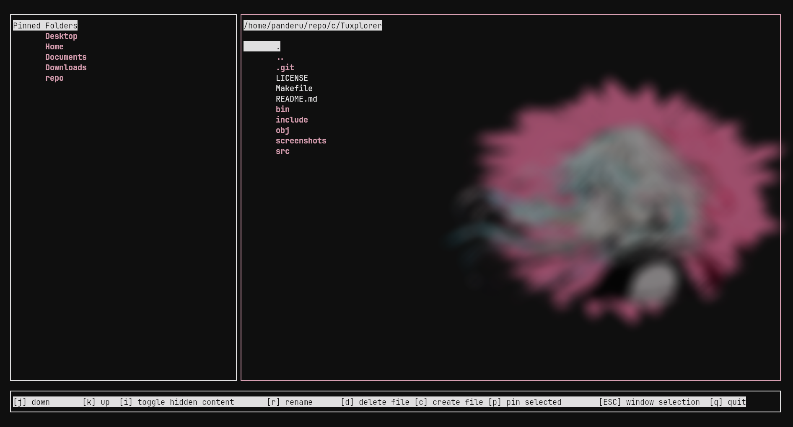

# Tuxplorer

Tuxplorer is a terminal-based file explorer, aimed at bringing the power and simplicity of file navigation and management to the terminal interface. Designed as my first real C project, Tuxplorer is currently in its early stages, featuring basic functionality with ambitions for a richer feature set in the future.

## Current Features

- **Basic Navigation**: Seamlessly move through your filesystem within the terminal.
- **File Viewing**: List files and directories in the current directory.
- **Vim Integration**: Open and edit text files directly in Vim by pressing enter on a selected file.
- **File Operations**: Perform common file operations such as rename, delete, and create directly within Tuxplorer.
- **Shortcuts**: Quick access shortcuts to frequently used directories such as Desktop, Documents, etc.
- **Pin Folders**: Ability to pin favorite folders for easy access.
- **Config Files**: Customize Tuxplorer's behavior through user-defined configuration files.

## Getting Started

To try out Tuxplorer, you'll need to have `gcc`, `ncurses` and `libconfig` installed on your system.
I am currently working on a package build but for now this'll have to do.

### Installation

1. Clone the repository:
`git clone https://github.com/Pand3ru/Tuxplorer`
2. Change to the Tuxplorer directory:
`cd Tuxplorer`
3. Compile the project:
`make`
4. Run Tuxplorer:
`./bin/tuxplorer`

## Contributing

While I am currently focusing on achieving personal development goals with Tuxplorer, contributions will be welcome in the future once the core functionality is established. This project serves as a learning journey for me, and I look forward to collaborating with the community to enhance Tuxplorer once the foundational features are in place.

## License

Distributed under the MIT License. See `LICENSE` for more information.

## Acknowledgments

- This project is inspired by the utility and simplicity of terminal-based workflows.

